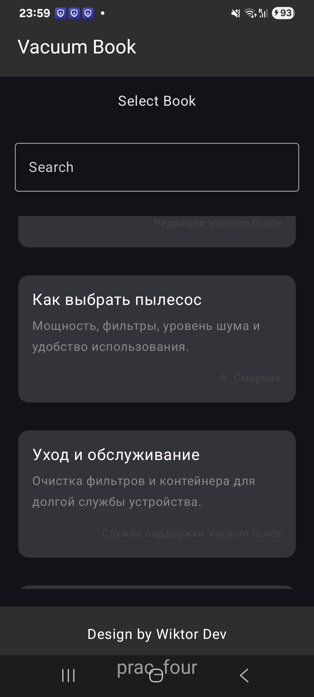
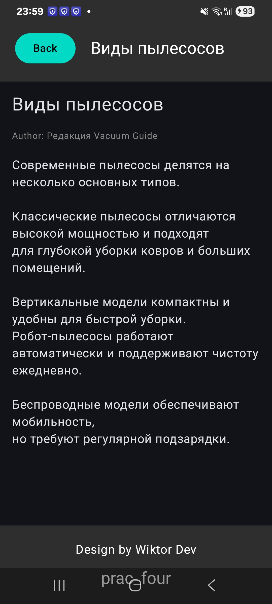
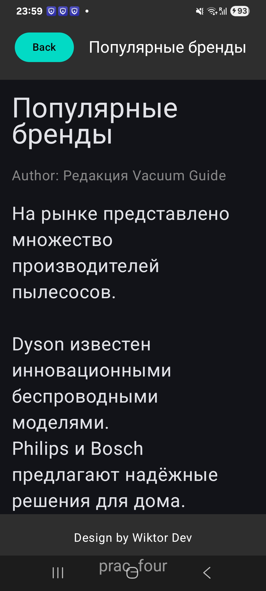
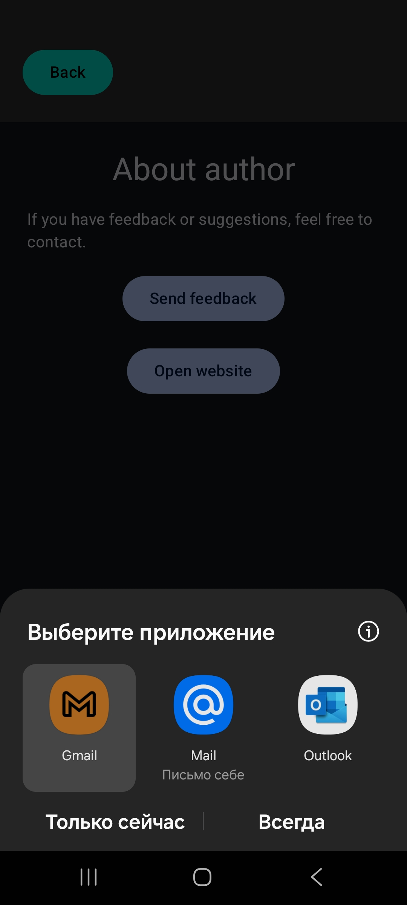
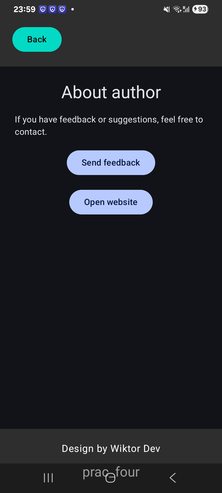

# Kotlin Practice Four — Vacuum Book (Electronic Guide App)

  

  
  
  
  

An **electronic book / reference application** built with **Kotlin and Jetpack Compose**.  
The project demonstrates **multi-screen navigation**, **search**, **gesture-based font scaling**, **state persistence**, and **external integrations** (email & website).

---

## 📱 Project Description

This application is an **electronic guide about vacuum cleaners**, structured as a book with thematic sections.

Users can:
- browse book sections
- search content
- read articles with **pinch-to-zoom**
- resume reading after app restart
- send feedback to the author
- open an external website

---

## ✅ Assignment Requirements Coverage

The project fully satisfies the assignment requirements:

- ✔ **Multiple thematic sections**
- ✔ **Navigation between screens**
- ✔ **Search functionality**
- ✔ **Font size change via touch gestures (pinch-to-zoom)**
- ✔ **State persistence (last read section)**
- ✔ **Recovery after screen rotation and app restart**
- ✔ **External website opening**
- ✔ **Email feedback to author**

---

## ✨ Key Features

- 📚 **Electronic book structure**
- 🔍 **Real-time search by section title**
- 🤏 **Pinch-to-zoom text scaling**
- 💾 **Last read section saved using DataStore**
- 🔁 **Automatic resume reading**
- 🌐 **External website integration**
- ✉️ **Email feedback via system mail client**
- 🎨 **Custom UI (no templates, no generators)**

---

## 🧱 Architecture

The project follows a **clean, UI-focused architecture**:

- `pages` — application screens
- `features` - features app
- `components` — reusable UI components
- `data` — book content and persistence
- `types` — data models
- `navigation` — routing logic

State is handled using **Compose state** (`remember`, `rememberSaveable`)  
Navigation is implemented with **Jetpack Navigation Compose**.

---

## 🖼 Screenshots

### Main Screen — All Sections

  
  
  

### Selected Book Section

  
  
  

### Pinch-to-Zoom Text

  
  

### About & Feedback Screen

  
  

---

## 🌐 External Resources

- **Website:**  
  https://wikto1133.netlify.app/

- **Feedback:**  
  Email is opened via system mail client using `mailto:` intent.

---

## 🚀 How to Run

1. Clone the repository  
2. Open the project in **Android Studio**
3. Wait for Gradle sync to complete
4. Run on an emulator or physical Android device

---

## 🧠 Notes

- All UI and logic were implemented **manually**
- No UI builders or templates were used
- The project focuses on:
  - gesture handling
  - navigation back stack behavior
  - state persistence
  - real-world UX scenarios

---

## 📄 License

Educational project created for learning and practice purposes.
